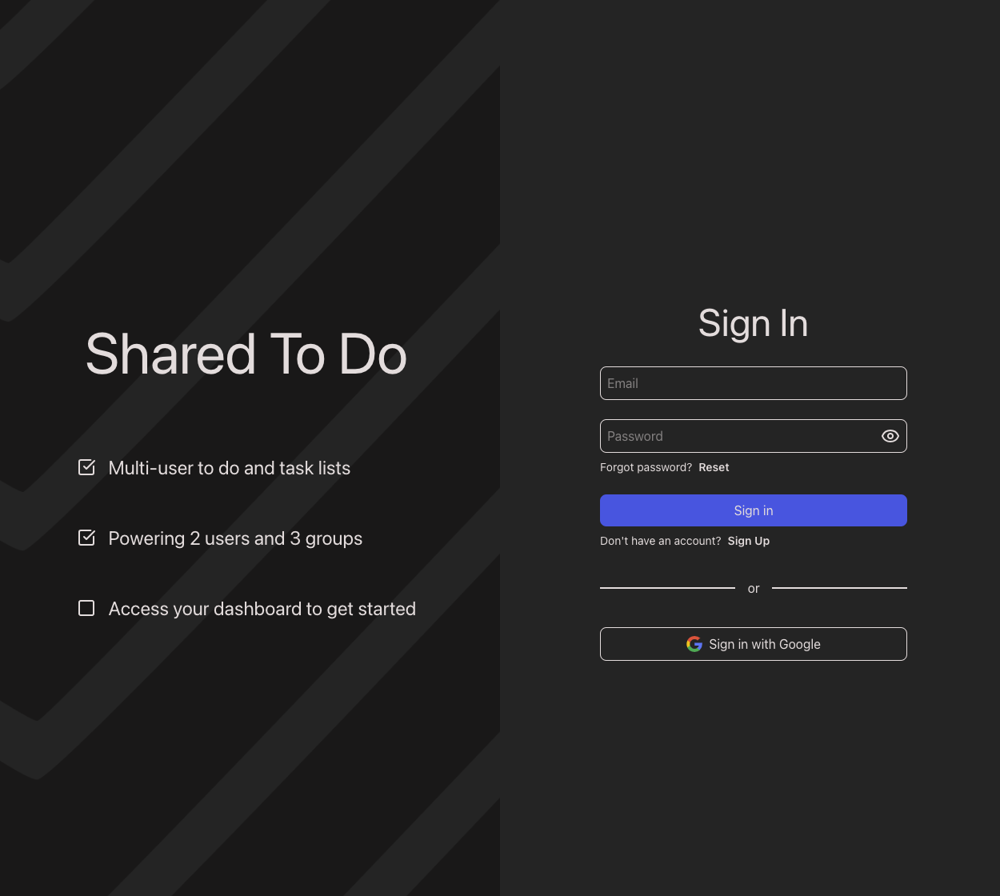
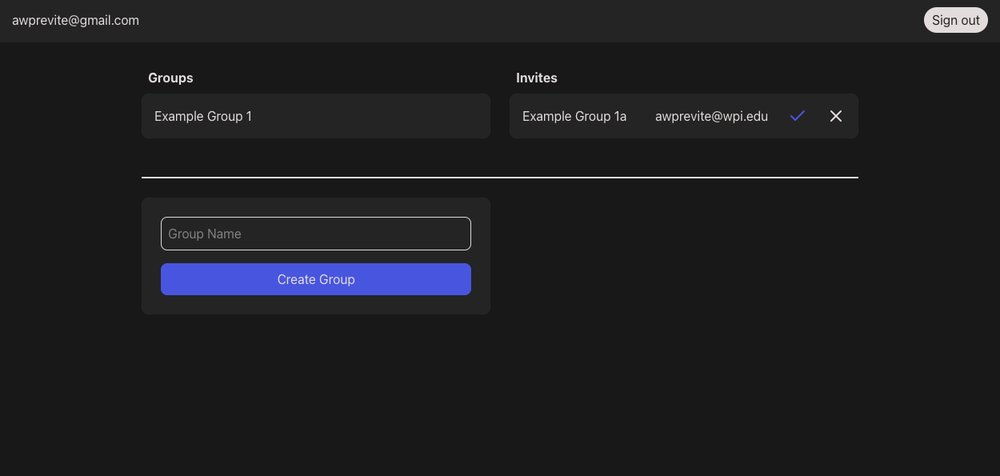
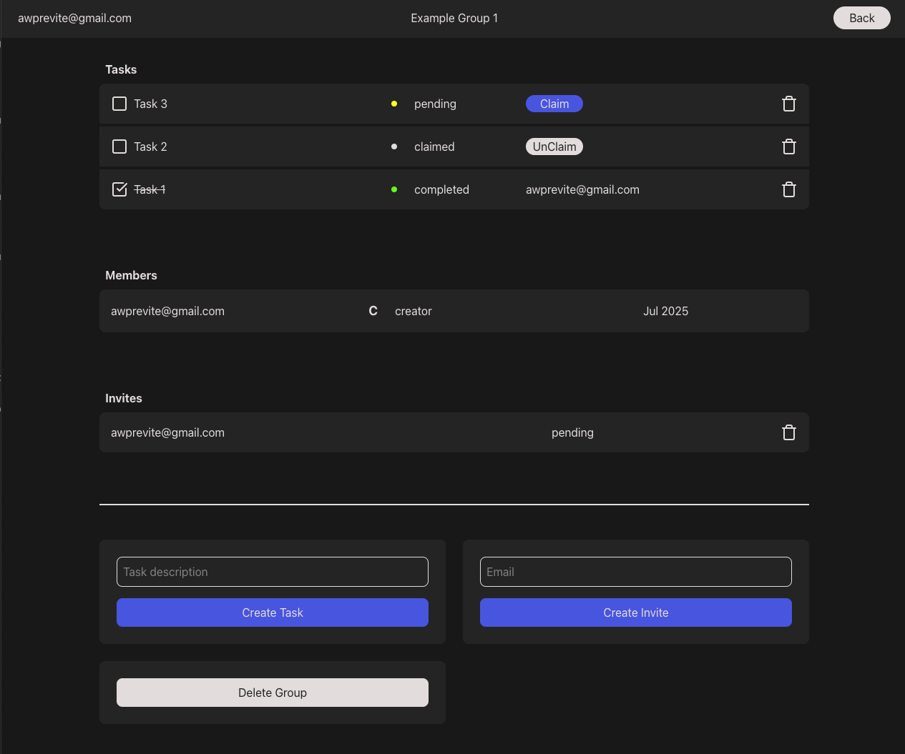
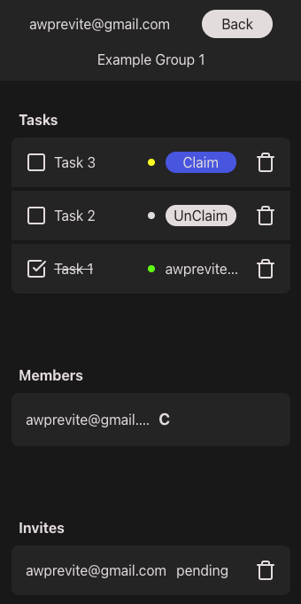

# Shared To Do

**Shared To Do** is a full-stack web app for managing tasks within collaborative user groups.  
It supports multi-user to-do lists with role-based permissions, allowing users to work together efficiently.  
All core features are currently functional and stable and can be used at https://shared-to-do-will1.vercel.app.

---

## Features

### User Authentication  
Sign up, sign in, and confirm your account via email and password - powered by **Supabase Auth**.

### Database Integration
Data is stored remotely for persistent access and collaboration - powered by **Supabase Database** and **PostgreSQL**.

### Group Management  
Create and manage groups. Invite users and assign roles.

### Task Management
Post tasks, claim them, and mark as completed.

### Role-Based Privileges  

| Role        | Privileges |
|-------------|------------|
| **Member**  | Claim/complete tasks |
| **Admin**   | Invite/remove members, create/delete tasks |
| **Creator** | Remove users, promote/demote users, delete group |

---

## Tech Stack  

- **Next.js**
- **React**
- **TypeScript**
- **Tailwind CSS**
- **Supabase**
- **PostgreSQL**

---

## Screenshots

### Login  
Sign in or sign up to access your account. 

### User Dashboard
View and access your groups and invites, create new groups, and sign out.  

### Group Dashboard (Admin)  
View and manage tasks, members, and invites, leave or delete the group, and navigate back to the user dashboard.  

### Mobile Group Dashboard (Admin)
Mobile group dashboard view (Admin)
Fully responsive layout for usability on devices of all sizes.  

---

## Future improvements  

### Core Features
- Password reset flow via Supabase
- Google authentication via Supabase
- Real-time syncing of data via Supabase
- Task due dates and user specific assignments
- Invite users via email (no longer limited to existing accounts)
- Activity log for task and group events

### User Experience
- More specific notifications
- Email provider set up via Resend for confirmations and notifications

### Deployment
- Custom domain via Vercel and update Supabase site URL
- Google AdSense

### Testing
- Add unit and integration tests using the existing vitest test setup
